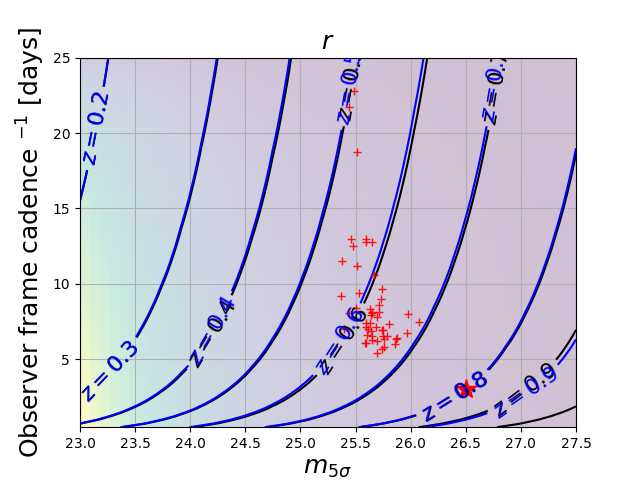
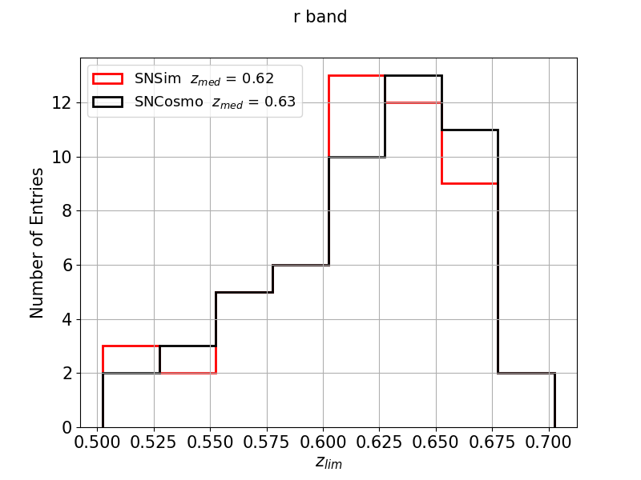
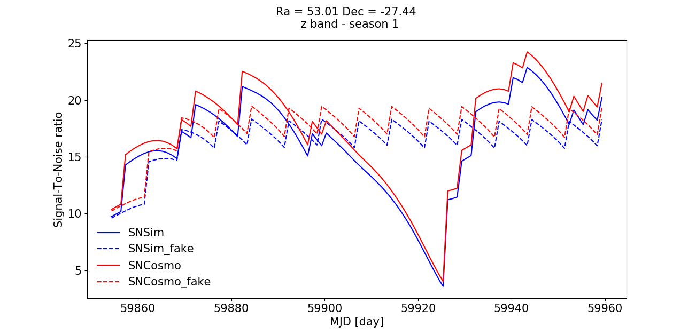

# sn_maf
sn_maf is a framework for estimating MAF metrics for supernovae (SN). It can also be used to simulate SN light curves. It proposes a set of python scripts that can be run along with yaml input files where specific parameters may be chosen.  The syntax to run a script is thus "python script_to_run param_file.yaml".

## **Instruction for installation**
  - git clone https://github.com/lsstdesc/sn_maf.git
  - cd sn_maf
  - git checkout dev

## **Running SN-MAF metrics**

### Environnement setup
- setup script: sn_maf/setups/setup_metric.sh
- This script requires up to two arguments and can be run:
  - @NERSC: source sn_maf/setups/setup_metric.sh NERSC
  - @CCIN2P3: source sn_maf/setups/setup_metric.sh CCIN2P3
- if you wish to run elsewhere then you need to provide the full path to the setup script corresponding to a release including the lsst_sims package, ie source sn_maf/setups/setup_metric.sh MYENV full_path_to_setup_script_stack.

### Running the Cadence metric
- python sn_maf/run_scripts/run_cadence_metric.py sn_maf/input/param_cadence_metric.yaml
- A description of the input yaml file is given [here](doc/yaml_cadence.md)
- you may have to change the 'filename' parameter to the OpSim db name you would like to use as input.
- output : a set of plots: 
- Mean cadence vs mean m5 (5-sigma depth) 
- Histogram of redshift limits 

### Running the Signal-to-Noise Ratio (SNR) metric
-  python sn_maf/run_scripts/run_snr_metric.py sn_maf/input/param_snr_metric.yaml
- A description of the input yaml file is given [here](doc/yaml_snr.md)
- you may have to change the 'filename' parameter to the OpSim db name you would like to use as input.
- output : a set of plots:
   - SNR vs Time (per band and per season) 

## **Running simulations**

 ### Environnement setup
- setup script: sn_maf/setups/setup_simulation.sh
- This script requires up to two arguments and can be run:
- @NERSC: source sn_maf/setups/setup_metric.sh NERSC
- @CCIN2P3: source sn_maf/setups/setup_metric.sh CCIN2P3
- if you wish to run elsewhere then you need to provide the full path to the setup script corresponding to a release including the lsst_sims package, ie source sn_maf/setups/setup_simulation.sh MYENV full_path_to_setup_script_stack.

### Performing simulations
- simulations using an OpSim database as input 
   - python sn_maf/run_scripts/run_simulation.py sn_maf/input/param_simulation.yaml
   - the choice of the simulator (two available at the moment: sncosmo and snfast) can be done in the param_simulation.yaml file.
   - two output files should be generated: Simu_name.hdf5 and LC_name.hdf5 where name will be replaced by the "ProductionID" chosen in the yaml file. These output files should be located in the "Output" directory specified in the yaml file. Simu_name.hdf5 contains a list of the light curves generated and LC_name.hdf5 contains the light curves (astropy tables).
- simulating "fake" observations 
   - python sn_maf/run_scripts/run_simulation.py sn_maf/input/param_fakesimulation.yaml
   - An example of parameters used for observations (cadence, bands, m5, ...) can be found in  sn_maf/input/Fake_cadence.yaml